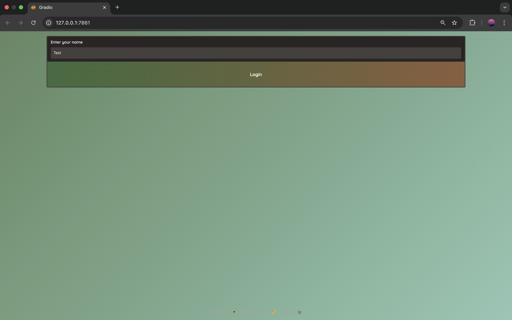
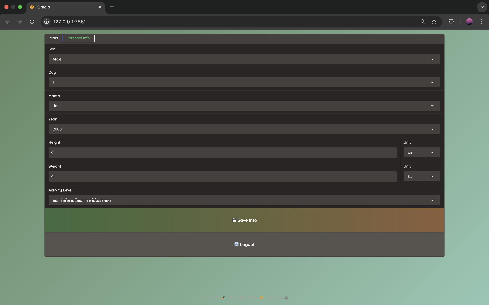
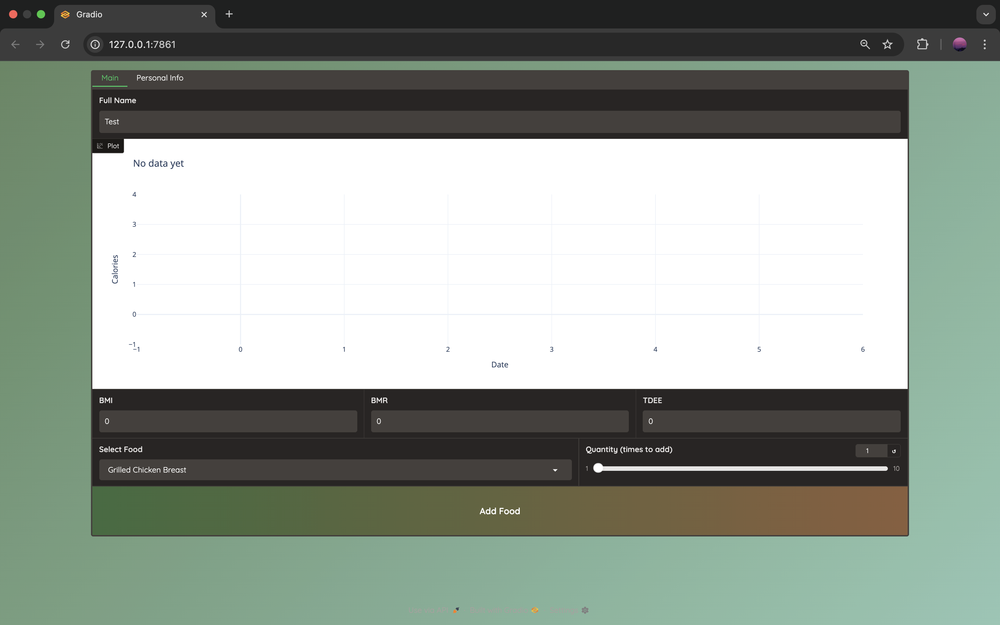

# Health & Nutrition Tracker

A Python application for tracking personal health data, monitoring nutrition, and generating health-related charts.  
This project is part of **EGBI122** as a mini-project by:

- Nathachai Rathamarit  
- Pattarachai Wanichprasertporn  

---




## Features

- **Personal Info Management:** Store and manage your personal health data in CSV files.  
- **Calorie Tracking:** Record and monitor daily calorie intake.  
- **Food Database:** Editable options for daily intake choices.  
- **Health Calculations:** Compute BMI, BMR, and TDEE.  
- **Data Visualization:** Generate charts to visualize health and nutrition trends with over-intake indicators.  

---

## Project Structure

```
├── LICENSE.md               # License file
├── app.py                   # Main application file
├── data                     # CSV files for storing data
│   ├── cal_rec.csv
│   ├── food_data.csv
│   └── personal_info.csv
└── modules                  # Python modules
    ├── __init__.py
    ├── calculators
    │   ├── __init__.py
    │   └── health_calculators.py
    ├── managers
    │   ├── __init__.py
    │   ├── chart_manager.py
    │   ├── food_manager.py
    │   └── personal_manager.py
    └── ui.py
```

> Note: `__pycache__` folders contain compiled Python files and are not needed in the repository.

---

## Installation

1. Clone the repository:
```bash
git clone https://github.com/flying-momonga-4325/egbi122-healthstat-cal
cd egbi122-healthstat-cal
```

2. Create a virtual environment (optional but recommended):
```bash
python -m venv venv
source venv/bin/activate  # Linux/macOS
venv\Scripts\activate     # Windows
```

3. Install dependencies:
```bash
pip install -r requirement.txt
```

---

## Usage

Run the main application:
```bash
python app.py
```

Follow the on-screen prompts to input personal info, record calories, or generate charts.

---

## License

This project is licensed under the MIT License.
